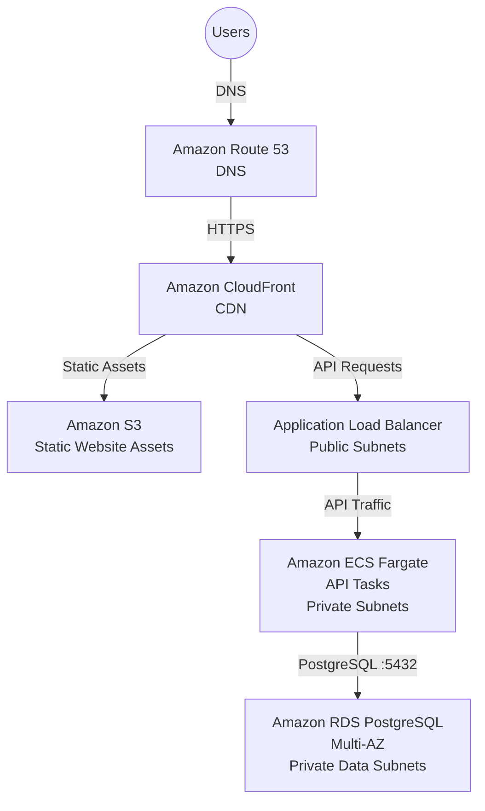

# Overall Architecture

## Goal

The goal is to give the SaaS product a launch-ready AWS architecture that can support 10,000 users and grow toward 500,000 users without a full redesign.

The design keeps the first version simple.

- Frontend: static React app on S3 and CloudFront
- API: stateless Node.js service on ECS Fargate
- Database: PostgreSQL on Amazon RDS
- Network: private subnets for application and database workloads
- Operations: managed AWS services where they reduce operational burden

## High-Level Flow

## Core AWS Services

- DNS: Route 53 provides public DNS for the application domain.
- CDN: CloudFront provides global caching, TLS edge delivery and frontend performance.
- Frontend: S3 stores the compiled React application.
- API: ECS Fargate runs the Node.js REST API without managing servers.
- Load balancing: ALB routes HTTPS traffic to healthy API tasks.
- Database: RDS PostgreSQL provides a managed relational database with Multi-AZ failover.
- Images: ECR stores API container images.
- Secrets: Secrets Manager stores database passwords and application secrets.
- Monitoring: CloudWatch provides logs, metrics, dashboards and alarms.

## Design Choices

The application tier is stateless so it can scale horizontally. Any user session state should live outside the API container, usually in tokens, the database or a shared cache if needed later.

The database is the most sensitive part of the design. It starts as one RDS PostgreSQL primary instance with Multi-AZ enabled. Read replicas and sharding are later-stage options, not launch requirements.

The network separates public entry points from private workloads. Only CloudFront and the ALB face the internet. ECS tasks and RDS stay in private subnets.

## What Is Intentionally Not Included Yet

This version does not introduce Kubernetes, multi-region active-active databases, event streaming or complex service meshes. Those may become useful later, but they add cost and operational load before the platform needs them.
