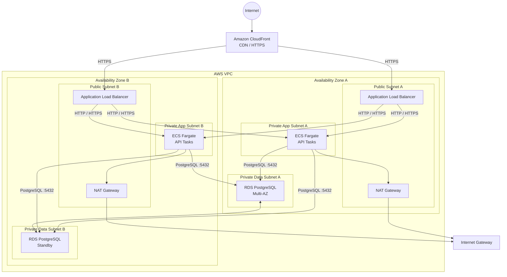
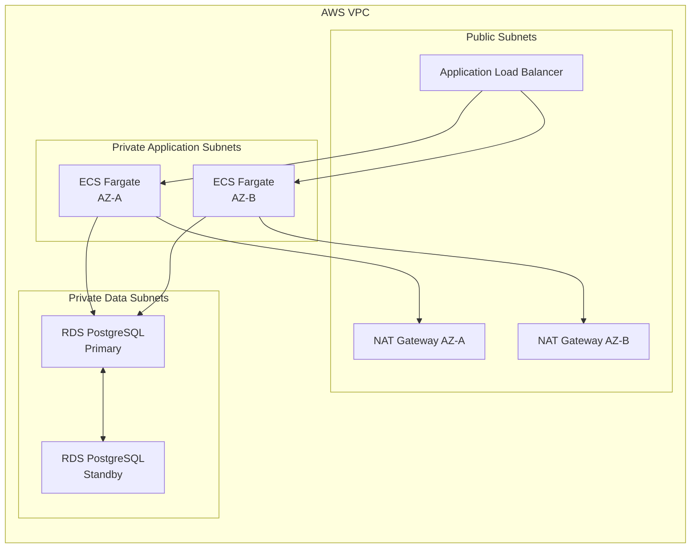
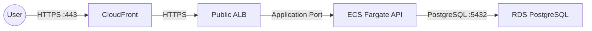
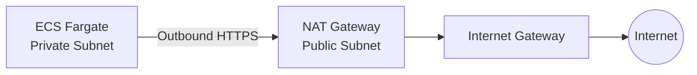
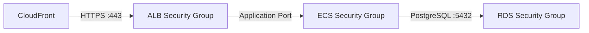

# Network Design

  

## VPC Architecture

  

The platform runs in a single VPC distributed across two Availability Zones. Public-facing components are isolated from application and database workloads.

  

## High-Level Architecture

  

  

## Network Layout

  

  
  

## Traffic Flow

  

  

## Outbound Traffic

  

  
  
  

## Subnet Design

| Layer | AZ-A | AZ-B | Internet Route |
|---|---|---|---|
| **Public** | ALB + NAT Gateway | ALB + NAT Gateway | Internet Gateway |
| **Application** | ECS Fargate | ECS Fargate | NAT Gateway |
| **Database** | RDS PostgreSQL | RDS PostgreSQL | None |

### Public Subnets
* **Hosted Resources:** Application Load Balancer (ALB), NAT Gateway (NAT GW)
* **Routing:** Public route tables route outbound traffic directly through the **Internet Gateway** for full internet connectivity.

### Private Application Subnets
* **Hosted Resources:** ECS Fargate API tasks
* **Routing:** These subnets have no direct internet exposure. Outbound internet traffic is securely routed through the **NAT Gateway** in the corresponding Availability Zone.

### Private Data Subnets
* **Hosted Resources:** RDS PostgreSQL
* **Routing:** Database subnets are fully isolated with **no route to the internet**. The RDS instances strictly accept database connections only from the ECS application security group.

  

## Security Group Flow

  

  

Security groups should reference other security groups rather than relying on broad CIDR ranges wherever possible.

  

## Security Boundaries

  

*  **CloudFront:** Public entry point and CDN layer.

*  **ALB:** Internet-facing load-balancing boundary.

*  **ECS:** Private application execution layer.

*  **RDS:** Isolated database layer.

*  **NAT Gateway:** Controlled outbound Internet access for private workloads.

*  **Security Groups:** Primary stateful network access control.

*  **NACLs:** Kept simple initially and tightened only where there is a documented requirement.

  

## Network ACLs
 

Network ACLs remain intentionally simple at launch.

  

Security Groups provide the primary workload-level access control because they are stateful and can reference other security groups.

  

NACLs can be introduced or tightened for specific subnet-level security requirements after validating the operational impact.