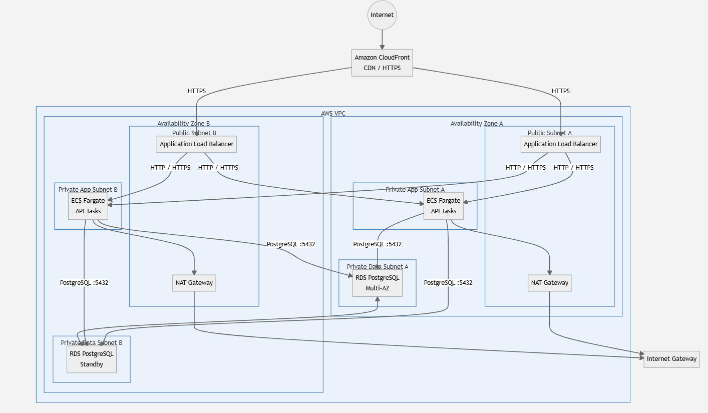

# AWS SaaS Platform Architecture

## Overview

This project documents the proposed AWS architecture for a SaaS application expected to serve **10,000 users at launch** and scale to **500,000 users within 18 months**.

- Frontend: React
- API: stateless Node.js REST API
- Database: PostgreSQL

The architecture is designed to be **scalable, highly available, secure and cost-conscious**, without requiring a major redesign as the platform grows.

For the full documentation list, start from [index.md](./docs/index.md).

## Architecture

### Supporting Services

- VPC: network isolation
- NAT Gateway: outbound access for private workloads
- ECR: container image registry
- Secrets Manager: application and database secrets
- IAM: least-privilege access
- ACM: TLS certificates
- CloudWatch: monitoring, logs and alarms

## Key Design Decisions

- CloudFront and S3: globally distributed React assets
- ECS Fargate: runs the stateless Node.js API without managing servers
- Application Load Balancer: HTTPS termination, health checks and traffic distribution
- RDS PostgreSQL Multi-AZ: database high availability
- Private subnets: keep API containers and database away from direct internet access
- ECS Service Auto Scaling: automatic API scaling
- IAM roles and Secrets Manager: avoids hard-coded credentials
- Multi-AZ deployment: reduces dependency on one Availability Zone

## Scaling Strategy

The API starts with a minimum of two Fargate tasks and scales horizontally based on workload metrics.

- CPU utilisation: compute pressure on API tasks
- Memory utilisation: memory pressure on API tasks
- ALB requests per target: traffic per running task
- Response latency: user-facing performance

Database scaling is handled independently through:

1. Query and index optimisation
2. Vertical scaling
3. RDS Proxy/connection pooling
4. Read replicas for read-heavy workloads
5. Partitioning or sharding only when justified by actual workload requirements

## High Availability

Critical workloads span at least two Availability Zones.

- ECS maintains API capacity across AZs.
- ALB distributes traffic across healthy tasks.
- RDS Multi-AZ maintains a standby database in another AZ.
- CloudFront provides globally distributed frontend delivery.

## Security Trust Model

- Public internet to ALB: HTTPS on port 443. The ALB is the public ingress entry point and uses ACM for SSL/TLS.
- ALB to private ECS tasks: HTTP on port 3000. Security groups restrict traffic to private subnet targets.
- Private ECS tasks to private RDS: TLS on port 5432. The database accepts inbound traffic only from the ECS security group.

The database is not publicly accessible, and security groups allow only the required communication between tiers.

## Cost Target

The launch architecture is designed to remain within the **$500/month** target under low traffic.

Cost optimisation focuses on:

- Fargate and RDS: right-size after observing traffic
- CloudFront: cache static assets effectively
- S3: use lifecycle policies where useful
- Monitoring: watch usage before committing to long-term capacity
- Savings Plans and Reserved capacity: evaluate after usage stabilises

## Design Principle

> **My principle is to start simple, keep each tier independently scalable, and introduce additional complexity only when the workload justifies it.**
